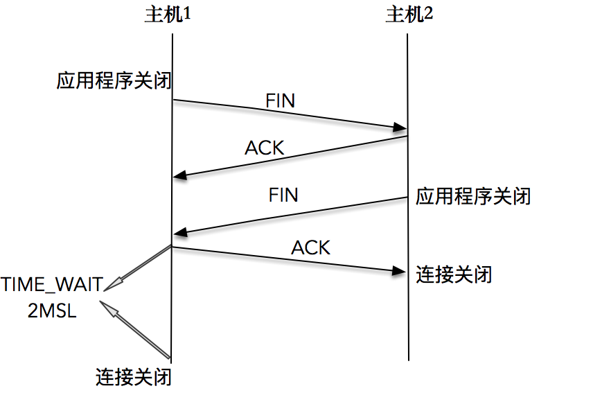
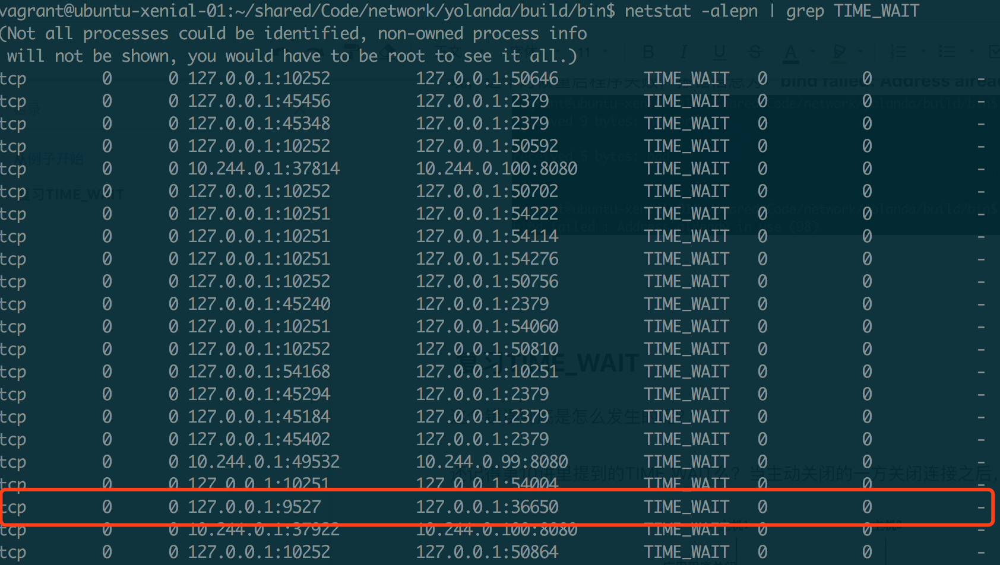

[TOC]

## 15 | 怎么老是出现“地址已经被使用”？

### 从例子开始

-   之前的一个 TCP 服务器端程序：

    -   ```C
        
        static int count;
        
        static void sig_int(int signo) {
            printf("\nreceived %d datagrams\n", count);
            exit(0);
        }
        
        int main(int argc, char **argv) {
            int listenfd;
            listenfd = socket(AF_INET, SOCK_STREAM, 0);
        
            struct sockaddr_in server_addr;
            bzero(&server_addr, sizeof(server_addr));
            server_addr.sin_family = AF_INET;
            server_addr.sin_addr.s_addr = htonl(INADDR_ANY);
            server_addr.sin_port = htons(SERV_PORT);
        
            int rt1 = bind(listenfd, (struct sockaddr *) &server_addr, sizeof(server_addr));
            if (rt1 < 0) {
                error(1, errno, "bind failed ");
            }
        
            int rt2 = listen(listenfd, LISTENQ);
            if (rt2 < 0) {
                error(1, errno, "listen failed ");
            }
        
            signal(SIGPIPE, SIG_IGN);
        
            int connfd;
            struct sockaddr_in client_addr;
            socklen_t client_len = sizeof(client_addr);
        
            if ((connfd = accept(listenfd, (struct sockaddr *) &client_addr, &client_len)) < 0) {
                error(1, errno, "bind failed ");
            }
        
            char message[MAXLINE];
            count = 0;
        
            for (;;) {
                int n = read(connfd, message, MAXLINE);
                if (n < 0) {
                    error(1, errno, "error read");
                } else if (n == 0) {
                    error(1, 0, "client closed \n");
                }
                message[n] = 0;
                printf("received %d bytes: %s\n", n, message);
                count++;
            }
        }
        ```

-   启动服务器，之后，我们使用 Telnet 登录这个服务器，在屏幕上输入一些字符。

-   telnet 客户端关闭连接后，服务器端接收到 EOF，也顺利地关闭了连接。

-   服务器端也可以很快重启，等待新的连接到来。

    -   ```bash
        
         $./addressused 
         received 9 bytes: network
         received 6 bytes: good
         client closed
         $./addressused
        ```

-   接下来，我们改变一下连接的关闭顺序。我不会在 telnet 端关闭连接，而是使用 Ctrl+C 的方式在服务器端关闭连接

    -   ```bash
        
        $telneet 127.0.0.1 9527
        network
        bad
        Connection closed by foreign host.
        ```

-   接下来，我尝试重启服务器端程序。会发现，这时，服务器端程序重启失败，报错信息为：`bind failed: Address already in use。`

    -   ```bash
        
         $./addressused 
         received 9 bytes: network
         received 6 bytes: good
         client closed
         $./addressused
         bind faied: Address already in use(98)
        ```

    -   

### 复用 TIME_WAIT

-   这个错误到底是怎么发生的呢？
-   **当连接的一方主动关闭连接，在接收到对端的 FIN 报文后，主动关闭连接的一方会在 TIME_WAIT 这个状态里停留一段时间，这个时间大约为 2MSL**。如下图：
    -   
-   如果，我们此时使用 netstat 去查看服务器程序所在主机的 TIME_WAIT 的状态连接，会发现如下图
    -   
-   通过服务器端发起关闭连接操作，引起了一个已有的 TCP 连接处于 TIME_WAIT 状态，正是这个 TIME_WAIT 的连接，使得服务器重启时，继续绑定在 127.0.0.1:9527 上的操作，返回了 `Address already is use` 的错误。

### 重用套接字选项

-   很小的概率下，客户端 telnet 使用了相同的端口，从而造成了新连接和旧连接相同，在现代 Linux 操作系统下，也不会有什么大问题，原因是对些进行了一些优化：

    1.  是新连接的 SYN 告知的初始序列号，一定比 TIME_WAIT 老连接的末序列号大，这样通过序列号就可以区别出新老连接。
    2.  开启了 tcp_timestamps，使用新的连接的时间戳比老连接的时间戳大，这样通过时间戳也只可以区别出新老连接。

-   在这样优化下，一个 TIME_WAIT 的 TCP 连接可以忽略掉旧连接，重新被新的连接所使用。

-   这就是重用套接字选项，通过给套接字配置可重用属性，告诉操作系统内核，这样的 TCP 连接完全可以复用 TIME_WAIT 状态的连接。

    -   ```C
        
        int on = 1;
        setsockopt(listenfd, SOL_SOCKET, SO_REUSEADDR, &on, sizeof(on));
        ```

    -   **SO_REUSEADDR 套接字选项，允许启动绑定在一个端口，即使之前存在一个和该端口一样的连接**。

-   对原来的服务器端代码进行升级：

    -   ```C
        
        nt main(int argc, char **argv) {
            int listenfd;
            listenfd = socket(AF_INET, SOCK_STREAM, 0);
        
            struct sockaddr_in server_addr;
            bzero(&server_addr, sizeof(server_addr));
            server_addr.sin_family = AF_INET;
            server_addr.sin_addr.s_addr = htonl(INADDR_ANY);
            server_addr.sin_port = htons(SERV_PORT);
        
            int on = 1;
            setsockopt(listenfd, SOL_SOCKET, SO_REUSEADDR, &on, sizeof(on));
        
            int rt1 = bind(listenfd, (struct sockaddr *) &server_addr, sizeof(server_addr));
            if (rt1 < 0) {
                error(1, errno, "bind failed ");
            }
        
            int rt2 = listen(listenfd, LISTENQ);
            if (rt2 < 0) {
                error(1, errno, "listen failed ");
            }
        
            signal(SIGPIPE, SIG_IGN);
        
            int connfd;
            struct sockaddr_in client_addr;
            socklen_t client_len = sizeof(client_addr);
        
            if ((connfd = accept(listenfd, (struct sockaddr *) &client_addr, &client_len)) < 0) {
                error(1, errno, "bind failed ");
            }
        
            char message[MAXLINE];
            count = 0;
        
            for (;;) {
                int n = read(connfd, message, MAXLINE);
                if (n < 0) {
                    error(1, errno, "error read");
                } else if (n == 0) {
                    error(1, 0, "client closed \n");
                }
                message[n] = 0;
                printf("received %d bytes: %s\n", n, message);
                count++;
            }
        }
        ```

-   重新编译，重复上面那个例子，使用 Ctrl + C 在服务器端关闭连接。马上尝试重启服务器，这时，我们发现，服务器正常启动，没出现 `Address already in use` 的错误。

    -   ```bash
        
         $./addressused2 
         received 9 bytes: network
         received 6 bytes: good
         client closed
         $./addressused2
        ```

-   SO_REUSEADDR 套接字还有一个作用，那就是本机服务器如果有多个地址，可以在不同地址上使用相同的端口提供服务。

-   我们必须给这三个服务设置 SO_REUSEADDR 套接字选项，否则第二个、第三个服务调用 bind 绑定到 80 端口时会出错。

### 最佳实践

-   **服务器端程序，都应该设置 SOREUSEADDR 套接字选项，以便在服务端程序可以在极短的时间内复用同一端口启动**。
-   tcp_tw_reuse 内核配置 VS SO_REUSEADDR 套接字，区别：
    -   其实，这两个东西一点关系也没有：
    -   tcp_tw_reuse 是内核选项，主要用在**连接发起方**。TIME_WAIT 状态的连接创建时间超过 1 秒后，新的连接才可以被复用。
    -   SO_REUSEADDR 是用户态选项，SO_REUSEADDR 选项用来告诉操作系统内核，如果端口已被占用，但是 TCP 连接状态位于 TIME_WAIT，可以重用端口。如果端口忙，而 TCP 处于其他状态，重用端口时依旧得到 `Address already in use`。

### 总结

-   **在所有 TCP 服务器程序中，调用 bind 之前请设置 SO_REUSEADDR 套接字选项**。

