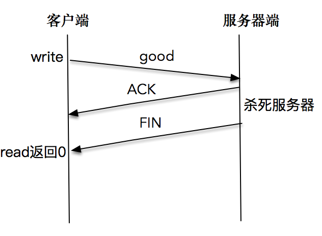

[toc]

## 17 | TCP 并不总是“可靠”的？

### TCP 是可靠的？

-   TCP 连接建立后，能感知 TCP 链路的方式是有限的，
    -   一种是以 read 为核心的读操作。
    -   另一种是以 write 为核心的写操作。

### 故障模式总结

-   

-   第一类，是对端无 FIN 包发送出来的情况。
-   第二类，是对端有 FIN 包发送出来的。

### 网络中断造成的，对端无 FIN 包

-   很多原因都会造成网络中断，这种情况下，TCP 程序并不能及时感知到异常信息。除非路由器发出一条 ICMP 报文，这里通过 read 或 write 调用就会返回 Unreachable 错误。
-   大多数，在没有 ICMP 报文的情况下，TCP 程序并不能理解感应到连接异常。如果程序是阻塞在 read 调用上，那，程序将无法从异常中恢复。我们可以通过给 read 操作设置超时来解决。（18 节中，会讲具体方法。）

### 系统崩溃造成的，对端无 FIN 包

-   当系统突然崩溃，网络连接上来不及发出任何东西。这里没有任何 FIN 包被发送出来。
-   这种情况，TCP 程序只能通过 read 和 write 调用得到网络连接异常的信息，超时错误是一个常见的结果。
-   还有一种情况，系统崩溃后，当重传的 TCP 分组到达重启后的系统，由于系统中没有该 TCP 分组对应的连接数据，系统会返回一个 RST 重置分节，TCP 程序通过 read 和 write 调用可以分别对 RST 进行错误处理。
    -   如果是阻塞 read 调用，会立即返回一个错误，错误信息为连接重置（Connection Reset）。
    -   如果是一次 write 操作，也会立即失败，应用程序会被返回一个 SIGPIPE 信号。

### 对端有 FIN 包发出

-   对端有 FIN 包发出，可能是对端调用了 close 或 shutdown。或对端应用程序崩溃时，操作系统内核代为清理所发出的。从应用程序角度上看，是无法区分哪种情形。
-   阻塞的 read 操作在完成正常接收的数据读取后，**FIN 包会通过返回一个 EOF 来完成通知，此时，read 调用返回 0**。这里强调一点，收到 FIN 包后，read 操作不会立即返回。可以这样理解，收到 FIN 包相当于，往接收缓冲区里放置了一个 EOF 符号，之前已经接收缓冲区的有效数据不会受影响。

-   服务端

    -   ```C
        
        //服务端程序
        int main(int argc, char **argv) {
            int connfd;
            char buf[1024];
        
            connfd = tcp_server(SERV_PORT);
        
            for (;;) {
                int n = read(connfd, buf, 1024);
                if (n < 0) {
                    error(1, errno, "error read");
                } else if (n == 0) {
                    error(1, 0, "client closed \n");
                }
        
                sleep(5);
        
                int write_nc = send(connfd, buf, n, 0);
                printf("send bytes: %zu \n", write_nc);
                if (write_nc < 0) {
                    error(1, errno, "error write");
                }
            }
        
            exit(0);
        }
        ```

-   客户端

    -   ```C
        
        //客户端程序
        int main(int argc, char **argv) {
            if (argc != 2) {
                error(1, 0, "usage: reliable_client01 <IPaddress>");
            }
        
            int socket_fd = tcp_client(argv[1], SERV_PORT);
            char buf[128];
            int len;
            int rc;
        
            while (fgets(buf, sizeof(buf), stdin) != NULL) {
                len = strlen(buf);
                rc = send(socket_fd, buf, len, 0);
                if (rc < 0)
                    error(1, errno, "write failed");
                rc = read(socket_fd, buf, sizeof(buf));
                if (rc < 0)
                    error(1, errno, "read failed");
                else if (rc == 0)
                    error(1, 0, "peer connection closed\n");
                else
                    fputs(buf, stdout);
            }
            exit(0);
        }
        ```

    -   

#### read 直接感知 FIN 包

-   依次启动服务器端和客户端程序，在客户端输入 good 字符后，迅速结束服务器端程序，这里需要赶在服务器端从睡眠中苏醒前杀死服务器程序。

    -   ```bash
        
        $./reliable_client01 127.0.0.1
        $ good
        $ peer connection closed
        ```

-   这说明**客户端程序通过 read 调用，感知到服务端发送的 FIN 包**，于是，正常退出了客户端程序。

    -   

### 通过 write 产生 RST，read 调用感知 RST

-   依次启动服务器端和客户端程序，在客户端输入 bad 字符后，等待一段时间，直到客户端正确显示了服务端回应，再杀死服务器程序。客户端再次输入 bad2，这里屏幕上打印 “peer connection closed“。

    -   ```bash
        
        $./reliable_client01 127.0.0.1
        $bad
        $bad
        $bad2
        $peer connection closed
        ```

    -   

-   很多文章、书籍，对这个程序的解读是，**收到 FIN 包的客户端继续合法地向服务器端发送数据，服务器端在无法定位该 TCP 连接信息的情况下，发送了 RST 信息，当程序调用 read 操作时，内核会将 RST 错误信息通知给应用程序**。这是一个典型的 write 操作造成的异步，通过 read 操作来感知异常的样例。

-   Linux 4.4 内核上实验这个程序，多次的结果都是，内核正常将 EOF 信息通知给应用程序，而不是 RST 错误信息。

-   Max OS 10.13.6 上尝试，read 操作可以返回 RST 异常信息。

    -   ```bash
        
        $./reliable_client01 127.0.0.1
        $bad
        $bad
        $bad2
        $read failed: Connection reset by peer (54)
        ```

    -   

### 向一个已关闭连接连续写，最终导致 SIGPIPE

-   服务器端：

    -   ```C
        
        nt main(int argc, char **argv) {
            int connfd;
            char buf[1024];
            int time = 0;
        
            connfd = tcp_server(SERV_PORT);
        
            while (1) {
                int n = read(connfd, buf, 1024);
                if (n < 0) {
                    error(1, errno, "error read");
                } else if (n == 0) {
                    error(1, 0, "client closed \n");
                }
        
                time++;
                fprintf(stdout, "1K read for %d \n", time);
                usleep(1000);
            }
        
            exit(0);
        }
        ```

-   客户端

    -   ```C
        
        int main(int argc, char **argv) {
            if (argc != 2) {
                error(1, 0, "usage: reliable_client02 <IPaddress>");
            }
        
            int socket_fd = tcp_client(argv[1], SERV_PORT);
        
            signal(SIGPIPE, SIG_IGN);
        
            char *msg = "network programming";
            ssize_t n_written;
        
            int count = 10000000;
            while (count > 0) {
                n_written = send(socket_fd, msg, strlen(msg), 0);
                fprintf(stdout, "send into buffer %ld \n", n_written);
                if (n_written <= 0) {
                    error(1, errno, "send error");
                    return -1;
                }
                count--;
            }
            return 0;
        }
        ```

-   如果在服务端读取数据并处理过程中，突然杀死服务器进程，我们会看到客户端很快也会退出，并在屏幕上打印“Connection reset by peer”。

    -   ```bash
        
        $./reliable_client02 127.0.0.1
        $send into buffer 5917291
        $send into buffer -1
        $send: Connection reset by peer
        ```

-   这是因为服务端程序被杀死后，操作系统内核会做一些清理的事情，为这个套接字发送一个 FIN 包，但是，客户端在收到 FIN 包后，没有 read 操作，还是会继续往这个套接字写入数据。这是因为根据 TCP 协议，**连接是双向的，收到对方的 FIN 包只意味着对方不会再发送任何消息**。在一个双方正常关闭流程中，收到 FIN 包的一端将剩余数据发送给对面（一个或多次 write），然后关闭套接字。

-   当数据到达服务器端时，操作系统内核发现这是一个指向关闭的套接字，会再次向客户端发送一个 RST 包，对于发送端而言，如果此时再执行 write 操作，立即会返回一个 RST 错误信息。

-   过程图

    -   

-   大部分的教程是这样说的：**在第二次 write 操作时，由于服务器端无法查询到对应的 TCP 连接信息，于是发送了一个 RST 包给客户端，客户端第二次操作时，应用程序会收到一个 SIGPIPE 信号**。如果不捕捉这个信号，应用程序会在毫无征兆的情况下直接退出。

-   Max OS 10.13.6 上尝试这个程序，结果确实如此。

    -   ```bash
        
        #send into buffer 19 
        #send into buffer -1 
        #send error: Broken pipe (32)
        ```

    -   

### 总结

-   这一讲，我们意识到 TCP 并不是那么可靠的。
-   我把故障分为两大类：
    -   一类是对端无 FIN 包，需要通过巡检或超时来发现。
    -   另一类是对端有 FIN 包，需要通过增强 read 或 write 操作的异常处理，帮助我们发现此类异常。

