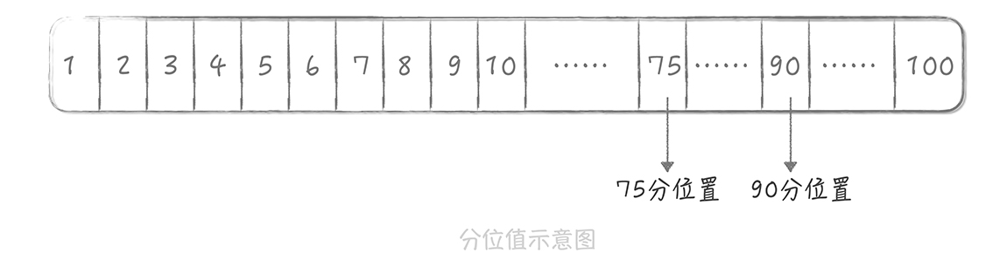

[toc]

## 03 | 系统设计目标（一）：如何提升系统性能？

-   “三高”：“高并发”、“高性能”、“高可用”
-   今天的话题：如何提升系统的性能？

-   高并发系统设计的三大目标：**高性能、高可用、可扩展**

-   **高并发**，是指运用设计手段让系统能够处理更多用户并发请求，也就是承担更大流量。它是一切架构设计的背景和前提，脱离了它去谈性能和可用性是没有意义的。
-   **性能和可用性**，是我们实现高并发系统设计必须要考虑的因素。
-   **可扩展性**，同样是高并发系统设计需要考虑的因素。

### 性能优化原则

-   **性能优化一定不能盲目，一定是问题导向的。**
-   **性能优化也遵循“二八原则”**。抓住主要矛盾。
-   **性能优化也要有数据支撑。**
-   **性能优化的过程是持续的。**

### 性能的度量指标

-   **明确性能度量指标十分重要。**
-   依据一些统计方法计算出特征值。这些特征值就能代码这段时间的性能情况。常见的特征值有以下几类。
    -   **平均值**
        -   平均值在一定程序上反应这段时间的性能，但它敏感度较差。
        -   **平均值对于度量性能来说只能作为一个参考。**
    -   **最大值**
        -   过于敏感。
    -   **分位值**
        -   分位值排除了偶发极慢请求对于数据的影响，能够很好地反应这段时间的性能，分位值越大，对于慢请求的影响就越敏感。
        -   
        -   **分位值是最适合作为时间段内，响应时间统计值来使用的**，在实际工作中也应用最多。
-   脱离了并发谈性能是没有意义的，我们常使用吞吐量或响应时间来度量并发和流量。这两个指标是呈倒数关系的。

### 高并发下的性能优化

#### 1. 提高系统的处理核心数

-   提高系统的处理核心数就是**增加系统的并行处理能力**，这个思路是优化性能最简单的途径。

#### 2. 减少单次任务响应时间

-   **CPU 密集型**系统中
    -   **选用高效的算法或减少运算次数就是这类系统重要的优化手段。**
-   **IO 密集型**系统中，发现这类性能瓶颈的手段主要有两类。
    1.  采用工具，
    2.  通过监控

### 课程小结

-   高并发下优化性能的基本思路
    -   数据优先，上线前把性能监控系统做好。
    -   掌握一些性能优化工具和方法，需要在工作中不断积累。
    -   计算机基础知识很重要，如网络、操作系统。

